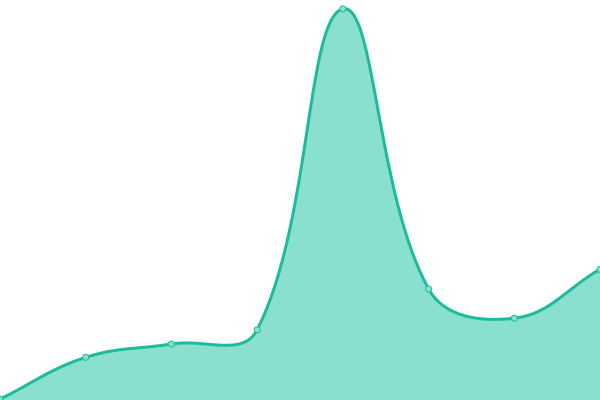

# [📈 Live Status](https://status.formsure.co): <!--live status--> **🟩 All systems operational**

This repository contains the open-source uptime monitor and status page for [Upptime](https://upptime.js.org), powered by [Upptime](https://github.com/upptime/upptime).

With [Upptime](https://upptime.js.org), you can get your own unlimited and free uptime monitor and status page, powered entirely by a GitHub repository. We use [Issues](https://github.com/upptime/upptime/issues) as incident reports, [Actions](https://github.com/formsure/status/actions) as uptime monitors, and [Pages](https://status.formsure.co) for the status page.

<!--start: status pages-->
<!-- This summary is generated by Upptime (https://github.com/upptime/upptime) -->
<!-- Do not edit this manually, your changes will be overwritten -->
<!-- prettier-ignore -->
| URL | Status | History | Response Time | Uptime |
| --- | ------ | ------- | ------------- | ------ |
|  [Website](https://formsure.co) | 🟩 Up | [website.yml](https://github.com/formsure/status/commits/HEAD/history/website.yml) | 

 127ms
     
 | 

<a href="https://status.formsure.co/history/website">100.00%</a>
    

|  [Fom.li - Formsure Forms](https://fom.li) | 🟩 Up | [fom-li-formsure-forms.yml](https://github.com/formsure/status/commits/HEAD/history/fom-li-formsure-forms.yml) | 

 221ms
     
 | 

<a href="https://status.formsure.co/history/fom-li-formsure-forms">99.66%</a>
    

|  [Formsure Dashboard](https://app.formsure.co) | 🟩 Up | [formsure-dashboard.yml](https://github.com/formsure/status/commits/HEAD/history/formsure-dashboard.yml) | 

 129ms
     
 | 

<a href="https://status.formsure.co/history/formsure-dashboard">99.84%</a>
    

|  [Formsure API](https://api.formsure.co/api/heartbeat) | 🟩 Up | [formsure-api.yml](https://github.com/formsure/status/commits/HEAD/history/formsure-api.yml) | 

 595ms
     
 | 

<a href="https://status.formsure.co/history/formsure-api">100.00%</a>
    

|  [Documentation](https://docs.formsure.co) | 🟩 Up | [documentation.yml](https://github.com/formsure/status/commits/HEAD/history/documentation.yml) | 

 107ms
     
 | 

<a href="https://status.formsure.co/history/documentation">100.00%</a>
    

<!--end: status pages-->

[**Visit our status website →**](https://status.formsure.co)

## 📄 License

- Powered by: [Upptime](https://github.com/upptime/upptime)
- Code: [MIT](./LICENSE) © [Upptime](https://upptime.js.org)
- Data in the `./history` directory: [Open Database License](https://opendatacommons.org/licenses/odbl/1-0/)
